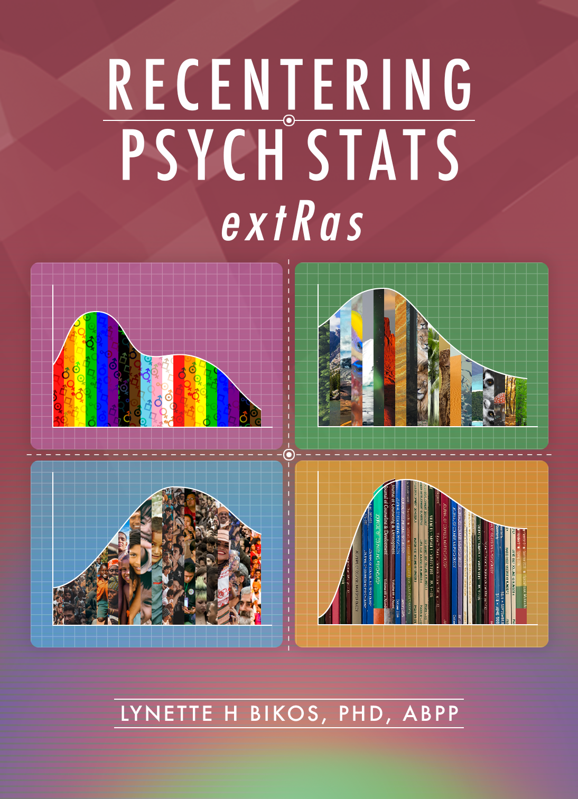

--- 
title: "ReCentering Psych Stats: extRas"
author: "Lynette H. Bikos, PhD, ABPP"
date: "`r Sys.Date()`"
site: bookdown::bookdown_site
documentclass: book
bibliography: STATSnMETH.bib #This is my own bibtex file from my Zotero account. If this file is not in the project folder there will be an error and the book will not build.
url: https://lhbikos.github.io/extRas/ #a link to the GitHub pages where it is rencered
cover-image: images/ReCenterPsychStats-extRas-bookcover.png #link to the image for the book however I don't think this did anything
description: |
  "extRas" is a mini-volume in the ReCentering Psych Stats series that is devoted to some of the technical tools and processes used that just do not fit easily in the regular volumes (e.g., ANOVA, psychometrics, multivariate). The examples and instructions may be somewhat limiting in that they have a specific use-case for graduate students in psychology programs at our institution.
link-citations: yes
github-repo: rstudio/bookdown-demo
---

# BOOK COVER {-}



# PREFACE {-}

**If you are viewing this document, you should know that this is a book-in-progress.  Early drafts are released for the purpose teaching my classes and gaining formative feedback from a host of stakeholders. The document was last updated on `r format (Sys.Date(), '%d %b %Y')`**.  Emerging volumes on other statistics are posted on the [ReCentering Psych Stats](https://lhbikos.github.io/BikosRVT/ReCenter.html) page at my research team's website. 

[Screencasted Lecture Link](https://spu.hosted.panopto.com/Panopto/Pages/Viewer.aspx?id=c932455e-ef06-444a-bdca-acf7012d759a)

To *center* a variable in regression means to set its value at zero and interpret all other values in relation to this reference point. Regarding race and gender, researchers often center male and White at zero. Further, it is typical that research vignettes in statistics textbooks are similarly seated in a White, Western (frequently U.S.), heteronormative, framework. The purpose of this project is to create a set of open educational resources (OER) appropriate for doctoral and post-doctoral training that contribute to a socially responsive pedagogy -- that is, it contributes to justice, equity, diversity, and inclusion. 

Statistics training in doctoral programs are frequently taught with fee-for-use programs (e.g., SPSS/AMOS, SAS, MPlus) that may not be readily available to the post-doctoral professional. In recent years, there has been an increase and improvement in R packages (e.g., *psych*, *lavaan*) used for in analyses common to psychological research. Correspondingly, many graduate programs are transitioning to statistics training in R (free and open source).  This is a challenge for post-doctoral psychologists who were trained with other software. This OER will offer statistics training with R and be freely available (specifically in a GitHub respository and posted through GitHub Pages) under a Creative Commons Attribution - Non Commercial - Share Alike license [CC BY-NC-SA 4.0]. 

Training models for doctoral programs in HSP are commonly scholar-practitioner, scientist-practitioner, or clinical-scientist.  An emerging model, the *scientist-practitioner-advocacy* training model incorporates social justice advocacy so that graduates are equipped to recognize and address the sociocultural context of oppression and unjust distribution of resources and opportunities [@mallinckrodt_scientist-practitioner-advocate_2014]. In statistics textbooks, the use of research vignettes engages the learner around a tangible scenario for identifying independent variables, dependent variables, covariates, and potential mechanisms of change. Many students recall examples in Field's  [-@field_discovering_2012] popular statistics text:  Viagra to teach one-way ANOVA, beer goggles for two-way ANOVA, and bushtucker for repeated measures.  What if the research vignettes were more socially responsive? 

In this OER, research vignettes will be from recently published articles where: 

* the author’s identity is from a group where scholarship is historically marginalized (e.g., BIPOC, LGBTQ+, LMIC[low-middle income countries]), 
* the research is responsive to issues of justice, equity, inclusion, diversity, 
* the lesson’s statistic is used in the article, and 
* there is sufficient information in the article to simulate the data for the chapter example(s) and practice problem(s); or it is publicly available.  

In training for multicultural competence, the saying, "A fish doesn't know that it's wet" is often used to convey the notion that we are often unaware of our own cultural characteristics. In recent months and years, there has been an increased awakening to the institutional and systemic racism that our systems are perpetuating. Queuing from the water metaphor, I am hopeful that a text that is recentered in the ways I have described can contribute to *changing the water* in higher education and in the profession of psychology.


## Copyright with Open Access {-}
<a rel="license" href="http://creativecommons.org/licenses/by-nc-sa/4.0/"></a>

This book is published under a a <a rel="license" href="http://creativecommons.org/licenses/by-nc-sa/4.0/">Creative Commons Attribution-NonCommercial-ShareAlike 4.0 International License</a>. This means that this book can be reused, remixed, retained, revised and redistributed (including commercially) as long as appropriate credit is given to the authors. If you remix, or modify the original version of this open textbook, you must redistribute all versions of this open textbook under the same license - CC BY-SA.

A [GitHub open-source repository](https://github.com/lhbikos/ReC_Psychometrics) contains all of the text and source code for the book, including data and images. 

# ACKNOWLEDGEMENTS {-}

As a doctoral student at the University of Kansas (1992-2005), I learned that "a foreign language" was a graduation requirement. *Please note that as one who studies the intersections of global, vocational, and sustainable psychology, I regret that I do not have language skills beyond English.* This could have been met with credit from high school my rural, mid-Missouri high school did not offer such classes. This requirement would have typically been met with courses taken during an undergraduate program -- but my non-teaching degree in the University of Missouri's School of Education was exempt from this. The requirement could have also been met with a computer language (fortran, C++) -- I did not have any of those either. There was a tiny footnote on my doctoral degree plan that indicated that a 2-credit course, "SPSS for Windows" would substitute for the language requirement.  Given that it was taught by my one of my favorite professors, I readily signed up. As it turns out, Samuel B. Green, PhD, was using the course to draft chapters in the textbook [@green_using_2014] that has been so helpful for so many. Unfortunately, Drs. Green (1947 - 2018) and Salkind (2947 - 2017) are no longer with us. I have worn out numerous versions of their text. Another favorite text of mine was Dr. Barbara Byrne's [-@byrne_structural_2016], "Structural Equation Modeling with AMOS." I loved the way she worked through each problem and paired it with a published journal article, so that the user could see how the statistical evaluation fit within the larger project/article. I took my tea-stained text with me to a workshop she taught at APA and was proud of the signature she added to it (a little catfur might have fallen out).  Dr. Byrne created SEM texts for a number of statistical programs (e.g., LISREL, EQS, MPlus). As I was learning R, I wrote Dr. Byrne, asking if she had an edition teaching SEM/CFA with R. She promptly wrote back, saying that she did not have the bandwidth to learn a new statistics package.  We lost Dr. Byrne in December 2020. I am so grateful to these role models for their contributions to my statistical training.  I am also grateful for the doctoral students who have taken my courses and are continuing to provide input for how to improve the materials.

The inspiration for training materials that re*center statistics and research methods came from the [Academics for Black Survival and Wellness Initiative](https://www.academics4blacklives.com/). This project, co-founded by Della V. Mosley, Ph.D., and Pearis L. Bellamy, M.S., made clear the necessity and urgency for change in higher education and the profession of psychology. 

At very practical levels, I am indebted to SPU's Library, and more specifically, SPU's Education, Technology, and Media Department.  Assistant Dean for Instructional Design and Emerging Technologies, R. John Robertson, MSc, MCS, has offered unlimited consultation, support, and connection. Senior Instructional Designer in Graphics & Illustrations, Dominic Wilkinson, designed the logo and bookcover.  Psychology and Scholarly Communications Librarian, Kristin Hoffman, MLIS, has provided consultation on topics ranging from OERS to citations. I am alo indebted to Associate Vice President, Teaching and Learning at Kwantlen Polytechnic University, Rajiv Jhangiani, PhD. Dr. Jhangiani's text [-@jhangiani_research_2019] was the first OER I ever used and I was grateful for his encouraging conversation.

Financial support for this project has been provided the following:

*  *Call to Action on Equity, Inclusion, Diversity, Justice, and Social Responsivity Request for Proposals* grant from the Association of Psychology Postdoctoral and Internship Centers (2021-2022). 
*  *Diversity Seed Grant*, Office of Inclusive Excellence and Advisory Council for Diversity and Reconciliation (ACDR), Seattle Pacific University.
*  *ETM Open Textbook & OER Development Funding*, Office of Education, Technology, & Media, Seattle Pacific University.  


```{r include=FALSE}
# automatically create a bib database for R packages
knitr::write_bib(c(
  .packages(), 'bookdown', 'knitr', 'rmarkdown'
), 'packages.bib')
```

<!--chapter:end:index.Rmd-->

# THE MECHANICS BEHIND THE OER {-}

# From *bookdown* to GitHub Pages {#book1}

[Screencast Link](https://spu.hosted.panopto.com/Panopto/Pages/Viewer.aspx?pid=7c20cc56-069a-40e2-abc7-adf3017f8c47)

*ReCentering Psych Stats* volumes are all created with a combination of R, R Studio, bookdown (the package), the GitHub, GitHub Desktop, GitHub Pages, and a host of packages. There is abundant information on all of these tools across the internet. In this lesson, I walk through the steps in creating the templated [bookdown](https://bookdown.org/) "book" using Yihui Xie's package and process.

*Note. If you are at an institution like mine and you have an enterprise-issued computer it may matter whether your R projects are on your local drive or a cloud-drive. At SPU it is possible to use R Studio with .rmd files and such on the local drive. But they will only knit if the projects are on the OneDrive directlry.*

## Creating a *bookdown* template

Before beginning the process, make sure you have installed bookdown:

```{r}
#install.packages("bookdown", dependencies = T)
```

Additionally, know in advance where (i.e., the parent folder) you want the book to be located. With this in mind:

1. Open R Studio
2. Under the "File" menu select
   - New Project (if prompted, you do not need to save the workspace image, although you may wish to save any files that you have worked on)
   - New Directory
   - Book project using *bookdown*
3. In the New Project Wizard
   - The "Directory name" will be both the project name and the name of the folder that houses all the bookdown parts and pieces. In my example "xtRas" is what I entered in "Directory name."
   - Use the "Browse" button to navigate to the parent folder. In my example, I selected "C/Users/myaccount/OneDrive - InstitutionName/ReCenterPsychStats"
   - Create Project

Once created, your project folder will be pre-populated with a number of objects that will serve as tutorials and templates for your work.

## Establishing an Output Directory (needed to publish on GitHub Pages)

If your goal is to present your book through the free webpages of GitHub Pages it is necessary to update some yml matter.  Specifically, navigate to the "_bookdown.yml" and edit it by adding script that will route the webpages (and their structure) to a folder titled "docs". In total, the entirety of script in my "_bookdown.yml" is this:


book_filename: "ReC_extRas"
delete_merged_file: true
language:
  ui:
    chapter_name: "Chapter "
output_dir: "docs"

## The *index.Rmd* File is First

In this section of the tutorial, I navigate to the "index.Rmd" file and merely change the .yml matter related to the title and author so that when we render the book to GitHub Pages we can see that it was, in fact, this project that was rendered.  

## Build the Book!

To build the book select the "Build" tab from the upper right hand box in R Studio.  Within that tab, select "Build Book." You can find the rendered book in the docs folder (which it created automatically if you added the command to the *_bookdown.yml* file). Select any of the html files and it will show you the built book.

## Send it to the GitHub

Using the GitHub Pages means that you also have a [GitHub](https://github.com) account. If you haven't already, register for an account. Additionally, make sure to download, install and open [GitHub Desktop](https://desktop.github.com/).  

Very briefly (because there is so much more), the GitHub is an open source community where you can (freely) create repositories and collaborate on them. The GitHub Desktop allows you to clone your repositories to your local environment, work on them, and then update the GitHub repository. In our case, we are starting with the bookdown R project on our local computer and turning it into a GitHub Repository. From this GitHub repo, it will be pushed to GitHub Pages.

1. Open GitHub Desktop
2. Under the "File" menu, select
   - Add local repository
   - With the "Choose" tool, navigate to the the folder that holds the bookdown project (in my case it was "extRas")
   - GitHub Desktop is smart and recognizes that it is not a Git repository. For now it has been working for me to select "create a repository" and use the GitHub Desktop defaults
3. Selct "Publish repository"
   - Optional to add a description
   
## Publish on GitHub Pages

Publishing the bookdown project to GitHub pages implies that you have aleady changed the "_bookdown.yml" script to include the *output_dir: "docs"* 

Select "Settings." Scroll to the bottom, to the "Danger Zone" to make sure that the repository is public. If not, select "Change visibility" and select "Make Public."

Still in settings, select "Pages" (menu bar on left). 

* Under "Source" select:  
  - Branch: main
  - /docs
  - save

After a few minutes, your webpage will be available at the website that was provided on the setup for GitHub Pages. It will look like: https:/YOURACCOUNT.github.io/YOURPROJECT/


   


<!--chapter:end:01-bookdown.Rmd-->

